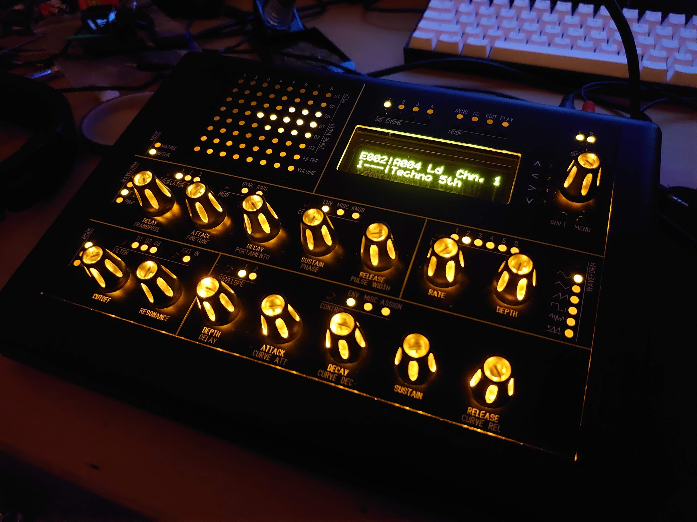
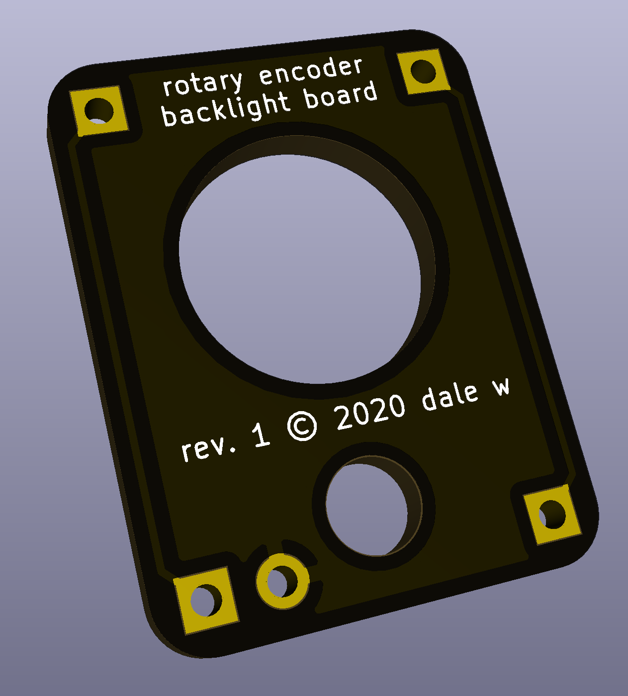
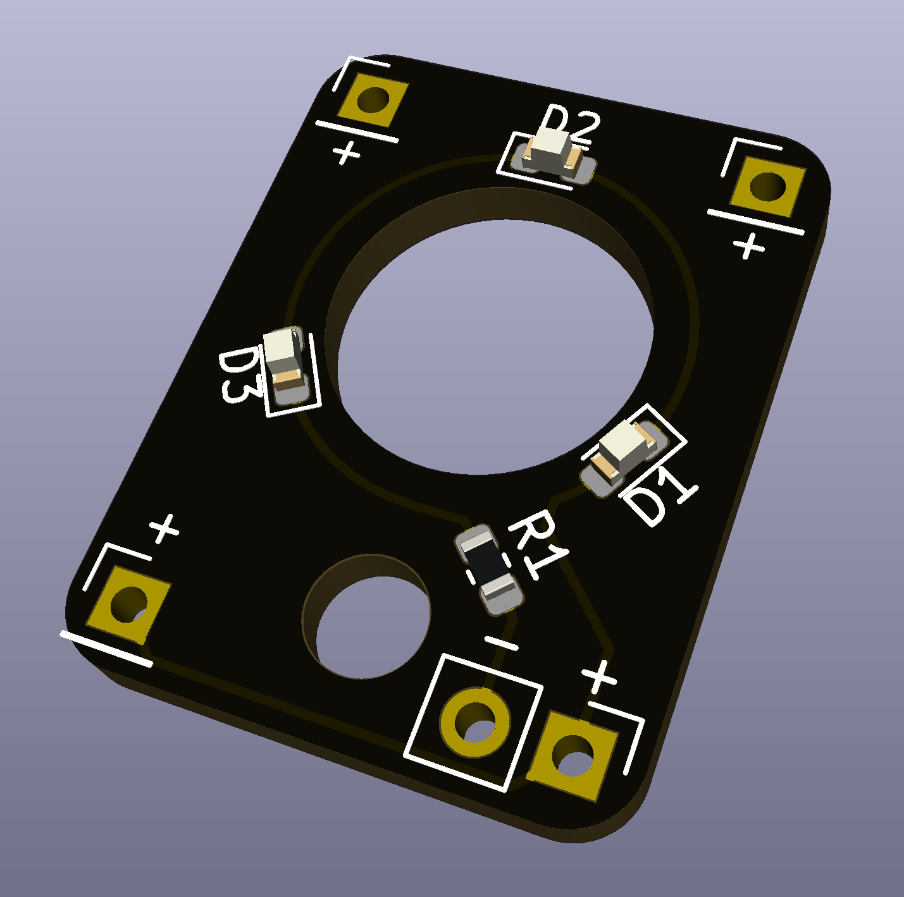
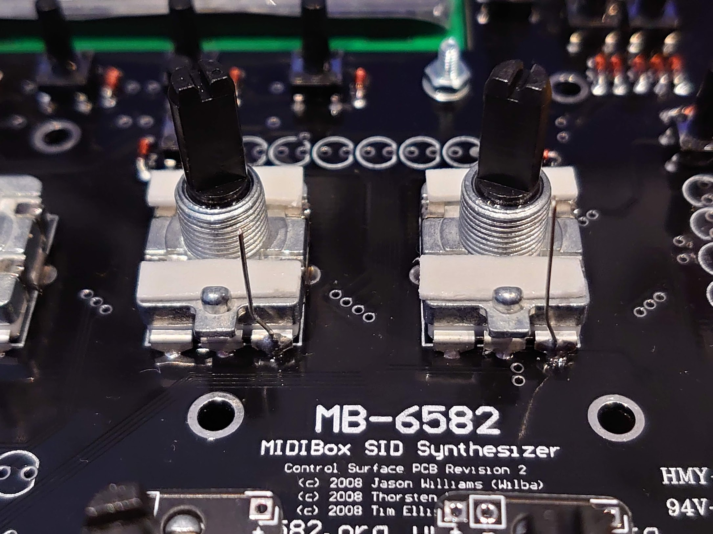
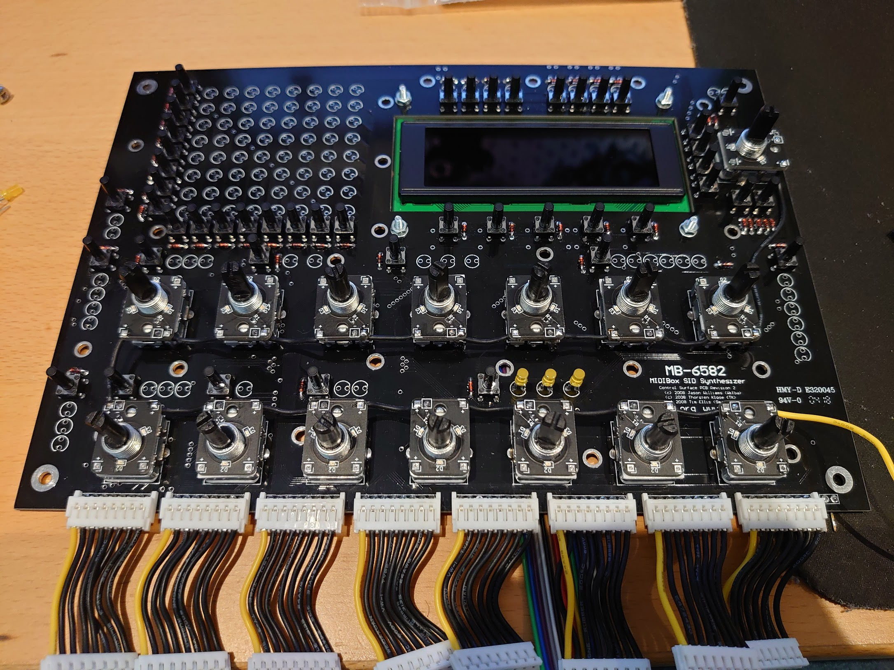
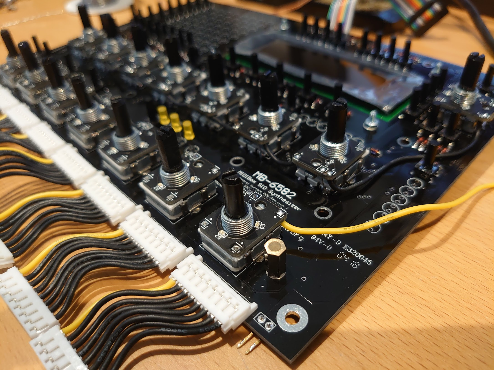
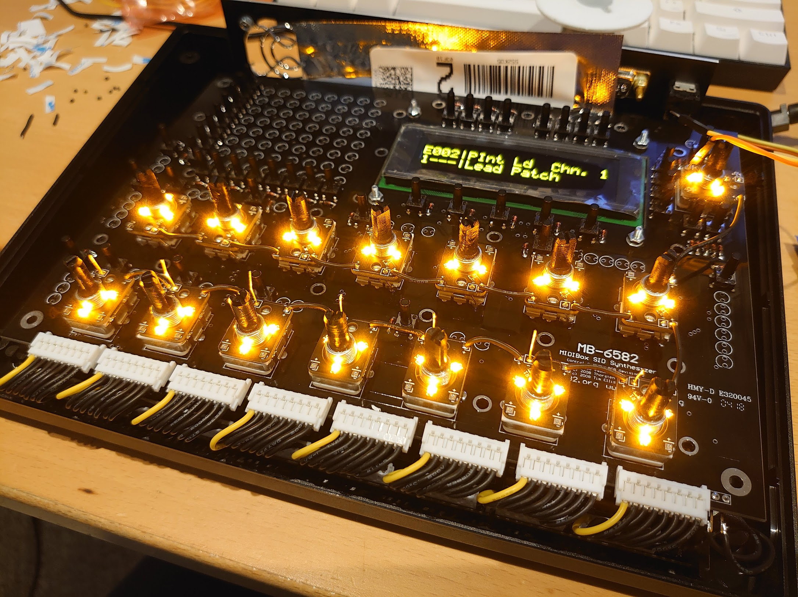

# Rotary encoder backlight board

This simple board allows you to neatly and painlessly install LEDs on top of a rotary encoder for use with transparent/translucent knobs.

I designed this board when building a [MIDIbox SID synthesizer based on the MB6582 design][midibox-sid]. The idea was inspired by [Hawkeye's control surface build tutorial for the MB6582][knob-backlight-tutorial], but I didn't think I'd personally be able to do a very neat job with enamel wire, and so I decided to design a simple PCB to make it easier to achieve this kind of lighting.

The PCB has been verified to fit perfectly over [Alpha Taiwan RE160F-40E3-20A-24P-003][alpha-encoder] and [Bourns PEC16-4220F-N0024][bourns-encoder].

## Where can I get them?

- I have several spare sets available to anyone who wants them - [contact me on Twitter][twitter] if you'd like to buy some!
- I've also added the PCB to [OSH Park][osh-park] as a shared project if you'd like to order from there.
- Alternatively, you can download this repository and place your own order with a PCB fab service.

## Installation

The PCB has space for three surface-mount LEDs and one resistor. The size of all parts is **0603 imperial (1608 metric)**.

There are multiple **+ (positive)** terminals that you can use to daisy-chain multiple PCBs together if you need to.

### Choosing the resistor value

The three LEDs are wired in series, and share a common resistor (`R1`). The proper value for `R1` will vary depending on the specifications of your LED and the voltage of your power source.

If your LEDs have a low enough voltage drop, you may be able to just bridge `R1` (or use a 0 ohm resistor) and use a 5V power source. The [amber LEDs I used][amber-leds] not light up at all this way however, and so I chose to use a 9V source instead.

You can use a [simple LED calculator][led-wizard] to help choose the right value for `R1`. In my case, using the datasheet for [my amber LEDs][amber-leds] I entered the following information into the calculator:

- Source voltage: **9V**
- Diode forward voltage: **2V**
- Diode forward current (mA): **20mA**
- Number of LEDs in your array: **3**

The result was **150 ohms**, and so that's the value I used for `R1`.

### Attaching the board to the encoder

1. Solder a wire to one or more of the **+ (positive)** terminal of the PCB. If space is limited above the encoder, it's recommended to solder the wire from the **back** of the board.
2. Take a small piece of rigid wire (the excess leads cut off from through-hole resistors or LEDs are ideal for this), and solder it to the ground terminal of your rotary encoder.
3. Bend a small "knee" in the wire so that it is fairly close to the "tongue" sticking out of the encoder, but not touching (see photo).
4. Place two small strips of adhesive foam on the front and back of the encoder (see photo). I recommend **3M PE foam tape** for this - it's very strong and thick enough to prevent shorts.
5. Place the PCB down over the encoder, ensuring the wire you soldered goes through the **- (negative)** hole.
6. Push down on the PCB to ensure it sticks nicely and then solder the negative wire.
7. Cut off the excess wire with a pair of wire cutters.
8. Make sure there are no shorts between the metal chassis of your encoders and any of the wires you have attached.
9. Repeat as necessary, daisy chaining the PCBs together via the **+ (positive)** terminals. The result should look like the photos below.

> **Note:** In the last photo above, the wires are shown above the PCBs. This was a mistake, as when test-fitting the metal front panel, there wasn't quite enough clearance, and so I moved them below the PCBs instead. I recommend you do the same.

[alpha-encoder]: https://www.mouser.co.uk/ProductDetail/318-ENC160F-24P
[amber-leds]: https://www.mouser.co.uk/ProductDetail/604-APT1608SYCK
[bourns-encoder]: https://www.mouser.co.uk/ProductDetail/652-PEC16-4220FN0024
[knob-backlight-tutorial]: http://midibox.org/forums/topic/14564-building-the-mb-6582-control-surface-photo-tutorial/?page=2#comment-139172
[led-wizard]: http://led.linear1.org/led.wiz
[midibox-sid]: http://www.midibox.org/dokuwiki/wilba_mb_6582
[osh-park]: https://oshpark.com/shared_projects/tsxIlm5c
[twitter]: https://twitter.com/_d0pefish_
